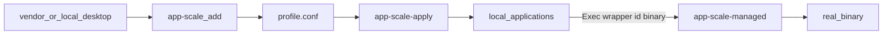

# linux-app-scale — implementation

## Flow



Install copies binaries to `~/.local/bin` and seeds `~/.config/linux-app-scale/config`. It does **not** create profiles. `add` is the adoption trigger.

## Profile schema

`~/.config/linux-app-scale/profiles/<id>.conf` (KEY=value, last wins):

| Key | Role |
|-----|------|
| `ID` | Sanitized id (`[a-z0-9][a-z0-9._-]*`) |
| `TOOLKIT` | `chromium` or `qt` (`gtk` refused) |
| `BINARY` | Absolute path from `Exec=` (or `--binary`) |
| `VENDOR_DESKTOP` | Source `.desktop` |
| `LOCAL_DESKTOP` | Override under `~/.local/share/applications/` |
| `SCALE` | Per-profile scale; empty inherits `DEVICE_SCALE_FACTOR` |
| `EXTRA_FLAGS` | Chromium argv extras (empty by default) |
| `EXTRA_ENV` | Qt `KEY=value` tokens (empty by default) |
| `REFRESH_FROM_VENDOR` | Copy vendor when newer (`0` if add targeted a local file) |
| `SOURCE` | `snap` / `deb` / `file` (informational) |

Marker `X-LinuxAppScale=<id>` is written into the local desktop so `remove` only deletes files this tool wrapped.

## Wrapper contract

```text
app-scale-managed <id> <absolute-binary> [args...]
```

- `chromium`: drop existing `--force-device-scale-factor=*`, prepend the profile scale, then `EXTRA_FLAGS`.
- `qt`: `env QT_SCALE_FACTOR=… QT_AUTO_SCREEN_SCALE_FACTOR=0 QT_SCREEN_SCALE_FACTORS=` plus `EXTRA_ENV`.
- Field codes (`%U`, `%u`, `%F`, `%f`) stay on `Exec=` because apply only substitutes the binary path.

Nested `*-managed` wrappers and `flatpak` in `Exec=` are refused at `add`. Two profiles may not share the same `LOCAL_DESKTOP`.

## Exec parse / transform / satisfied

`add` reads only the first `Exec=` under `[Desktop Entry]`:

1. Refuse if the body contains `flatpak` or `*-managed `.
2. Take `--binary` if given; else the first absolute path that is not a `.desktop` and not `KEY=value`; else `command -v` on the first non-flag token.
3. Preserve trailing field codes (`%U` / `%u` / `%F` / `%f`) by never rewriting them — apply substitutes only the binary substring.

`already_wrapped` is true iff `app-scale-managed <ID> <BINARY>` appears (space or tab). Transform replaces the first `BINARY` occurrence with `wrapper ID BINARY`. Only `[Desktop Entry]` `Exec=` lines are rewritten; `[Desktop Action *]` is left alone.

Vendor refresh copies first when the vendor file is newer, then wrap. Wrapper exit 2 if both profile `SCALE` and global `DEVICE_SCALE_FACTOR` are empty (no 1.25 default).

## Reconciler

`app-scale-apply` walks all profiles (or `--id`). It copies vendor → local when `REFRESH_FROM_VENDOR=1` and the vendor file is newer, then wraps `Exec=`. `--check` exits 1 if a write would occur.

## systemd

| Unit | Role |
|------|------|
| `app-scale-apply.path` | `PathChanged` on `/var/lib/snapd/desktop/applications` and `/usr/share/applications` only |
| `app-scale-apply.service` | oneshot `app-scale-apply --quiet` |
| `app-scale-apply.timer` | boot + 24 h backup |

Local applications is **not** watched: apply writes there and would retrigger.

## Verify

`scripts/verify-linux-app-scale.sh` (needs `APP_SCALE_ROOT` when the script is installed): `bash -n`, `py_compile`, fixture add for chromium + qt, `%U` preserved, gtk refused, remove deletes local desktops.
